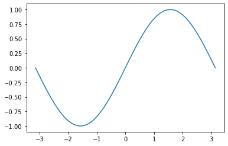

<a name="intro"></a>
# Introdução ao Jupyter Notebook

O jupyter é uma das ferramentas mais utilizadas hoje na área da computação, possuindo suporte para mais de 40 linguagens de programação. Com ele você pode criar um ambiente de programação que é acessado através da web. É utilizado principalmente pela facilidade de compartilhamento, e por ser um ambiente propício à utilização de equações, visualizações e textos explicativos, como em uma aula igual a essa! 
Outra vantagem é a atualização em tempo real, e também o precioso autosave (porém, é sempre bom salvar utilizando o atalho _Ctrl + S_).

O website oficial do jupyter é http://jupyter.org, e também pode ser testado online através do link http://try.jupyter.org (ou https://jupyter.org/try), sem a necessidade de instalá-lo.

Este que você está acessando agora mesmo pelo repositório é um jupyter notebook. Nele podemos observar o resultado final do arquivo de códigos. O documento também pode ser compartilhado e acessado através do link https://nbviewer.jupyter.org/

## Sumário 
1. [Instalação](#jupyter1) 
2. [Acessando o ambiente notebook e criando seu projeto](#jupyter2)
3. [Atalhos](#jupyter3)
4. [Escrevendo seu primeiro código](#jupyter4)
5. [Fazendo o download do código](#jupyter5)
6. [O sistema de notação Markdown](#jupyter6)
7. [Os gráficos no Jupyter Notebook](#jupyter7)
8. [Executando um código inteiro](#jupyter8)
9. [Extensões](#jupyter9)
    

## 1. Instalação <a name="jupyter1"></a> [🠡](#intro)

Para instalar a ferramenta, uma das principais formas é realizar primeiramente a instalação do python de acordo com seu sistema operacional (http://python.org/downloads/).

O jupyter notebook não vem junto ao python. Nesse método de instalação, precisamos instalar a ferramenta através do comando "pip install jupyter", executado no Terminal de seu Sistema Operacional (SO) ou dentro do seu software de programação.


## 2. Acessando o ambiente notebook e criando seu projeto <a name="jupyter2"></a> [🠡](#intro)

Dentro do Terminal, podemos executar um jupyter notebook através do comando "jupyter notebook". Se tudo deu certo, uma aba será aberta em seu navegador principal. O link para acessá-lo será por padrão http://localhost:8888/, podendo ser utilizado em outros navegadores e aberto em mais de uma aba.

Na plataforma será mostrada sua pasta raíz, suas pastas e subpastas, além dos arquivos de sua máquina. É recomendável criar uma pasta só para seus projetos feitos no jupyter. Para isso, pode ser criada através do botão New ou na própria Área de Trabalho. Ao criar o novo folder, clique no botão de sincronizar para que atualize.


**Atenção!!** As imagens inseridas acima estão dentro dessa pasta. Elas também podem ser inseridas através de uma URL. Utilizei o comando abaixo:

``````

## 3. Atalhos <a name="jupyter3"></a> [🠡](#intro)

Aprender os atalhos ao longo do processo de aprendizagem será de grande utilidade pois agilizam o desenvolvimento do código. Essa linha de código e todas acima dessa, por exemplo, foram transformadas em células Markdown através do atalho "M". Para isso, clique na região em branco à esquerda (ou aperte ESC) para selecionar a célula e conseguir alterar suas propriedades.

O atalho CONTROL + ENTER confirma a célula selecionada.
Já o atalho ALT + ENTER, além de confirmar, cria uma célula abaixo da selecionada.

## 4. Escrevendo seu primeiro código <a name="jupyter4"></a> [🠡](#intro)
Agora já podemos começar os testes em linguagem Python. Para isso, a célula deve estar em formato Code (atalho "Y"). Este é o formato padrão de todas células.


```python
import numpy as np

a = np.arange(1, 10, 1)

a.mean()
```


    5.0


A biblioteca numpy, dentre outras, já vem instalada no jupyter notebook e pode ser importada sem instalações.


```python
print("Estou no jupyter notebook!")
```

    Estou no jupyter notebook!
    

O output foi exibido dentro da própria célula! Desenvolver as partes de seu código se torna algo prático dentro desse ambiente.

## 5. Fazendo o download do código <a name="jupyter5"></a> [🠡](#intro)

Após desenvolver seu código, você pode realizar o download dele em diversos formatos, incluindo no próprio formato jupyter notebook e no formato python.


## 6. O sistema de notação Markdown <a name="jupyter6"></a> [🠡](#intro)

Caso queira realizar anotações semelhantes ou melhores dentro de seu código, além de transformar a célula em formato Markdown (atalho "M"), você deve aprender a formatar em Markdown. Através dessa linguagem de formatação, podemos inserir imagens, criar tabelas, fórmulas matemáticas e utilizar outros símbolos (LaTeX), formatar os caracteres, fazer um sumário, entre diversas outras possibilidades!

Recomendo acessar a documentação do Markdown ou buscar no Google ou no Youtube para aprender e treinar essa **linguagem de marcação**, será muito útil no futuro.

https://www.markdownguide.org/basic-syntax/

## 7. Os gráficos no Jupyter Notebook <a name="jupyter7"></a> [🠡](#intro)

Criar e exibir gráficos nesse ambiente é muito fácil, pois podem ser exibidos com um único comando! Uma das bibliotecas utilizadas para isso é a matplotlit, e o comando para chamar o gráfico é o _matplotlib.pyplot.plot_, nesse caso simplifiquei para ser apenas _plt.plot_. Você pode alterar a visualização de acordo com suas preferências. Tabelas também podem ser exibidas de acordo com sua preferência (é inviável exibir uma tabela gigante nesse ambiente).


```python
import numpy as np
import matplotlib.pyplot as plt

x = np.linspace(-np.pi, np.pi, 100)
y = np.sin(x)
plt.plot(x,y)
```


    [<matplotlib.lines.Line2D at 0x239f85810a0>]


    

    


**Atenção!** Para poder utilizar a biblioteca matplotlib, eu precisei instalá-la antes. Para isso, utilizei o código _pip install matplotlib_ em meu Terminal.

## 8. Executando um código inteiro <a name="jupyter8"></a> [🠡](#intro)

Para executar um código inteiro, e se o documento foi escrito para ser executado por completo, o melhor jeito é selecionar a aba _Cell_ e a opção _Run All_. Um outro jeito muito útil é o de executar célula por célula, em ordem crescente. Isso pode ser feito através do atalho _Ctrl + Enter_. A vantagem desse último método é a visualização por etapas, acompanhando  cada um dos inputs e outputs.


## 9. Extensões <a name="jupyter9"></a> [🠡](#intro)

Além de todas as possibilidades vistas anteriormente, uma das grandes vantagens do jupyter notebook é a instalação de **extensões**, que modificam a forma de desenvolvimento dentro do ambiente notebook, cria facilidades e permite ao desenvolvedor adaptar o ambiente de acordo com seu gosto pessoal.

Para ter acesso às extensões, vamos instalar o sistema de extensões através do Terminal de seu SO.

_pip install jupyter_contrib_nbextensions_

Uma das extensões mais utilizadas é a de _autocomplete_.

Para mais informações, acesse o site dos desenvolvedores (https://jupyter-contrib-nbextensions.readthedocs.io/en/latest/install.html)
